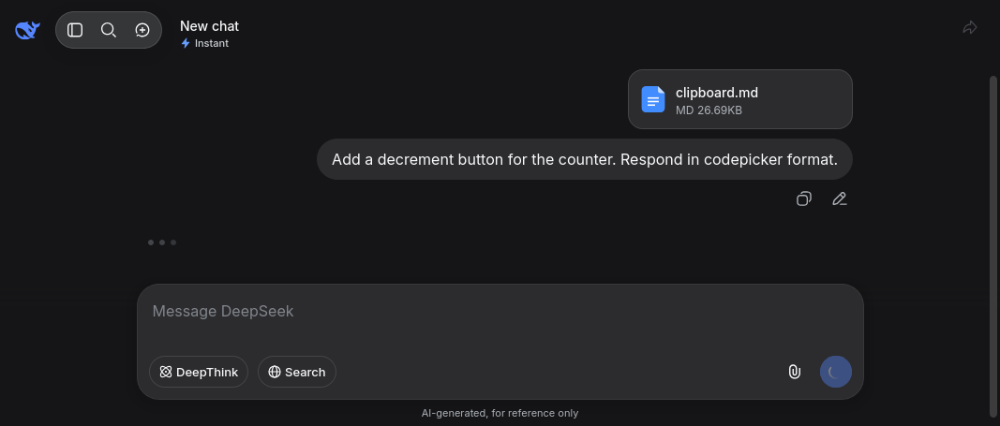
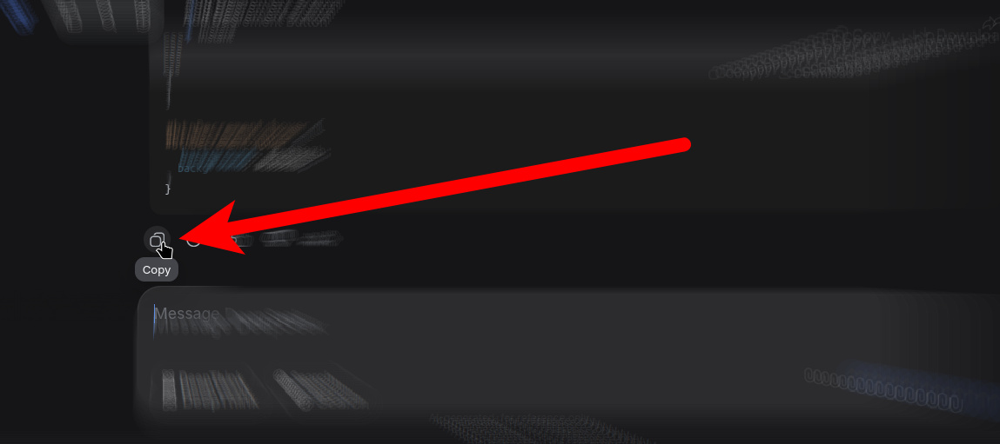

# Ejemplo de uso

Veamos un ejemplo práctico. Hasta ahora tenemos el siguiente proyecto, es un botón que al hacer click encima le suma +1 al contador:

::: code-group

```js [script.js]
const counterElement = document.getElementById('counter');
const button = document.getElementById('btnIncrement');

let count = 0;

button.addEventListener('click', () => {
  count++;
  counterElement.textContent = count;
});
```

```html [index.html]
<!doctype html>
<html lang="en">
  <head>
    <meta charset="UTF-8" />
    <meta name="viewport" content="width=device-width, initial-scale=1.0" />
    <title>Counter</title>
  </head>
  <body>
    <div class="container">
      <h1>Counter</h1>
      <p id="counter">0</p>
      <button id="btnIncrement">Increment</button>
    </div>
    <script src="script.js"></script>
  </body>
</html>
```

:::

Supongamos que además del botón de aumentar, necesitamos un botón para reducir el contador. Como somos muy productivos _(\*muy vagos)_, utilizaremos Codepicker para que alguna IA lo haga. Así que ejecutamos en la terminal el comando

```shell
codepicker "**" -c
```

Esto hace que se copie en nuestro portapapeles el contenido del proyecto entero. A continuación, vayamos a Deepseek y pidamos lo que nos hace falta



Cuando responda, copiamos directamente su respuesta



Y ejecutamos el comando de aplicar los cambios

```shell
codepicker apply -c
```

Listo! Se acaba de insertar el cambio en todos los archivos del proyecto:

::: code-group

```js [script.js]
const counterElement = document.getElementById('counter');
const incrementButton = document.getElementById('btnIncrement');
const decrementButton = document.getElementById('btnDecrement'); // [!code ++]

let count = 0;

incrementButton.addEventListener('click', () => {
  count++;
  counterElement.textContent = count;
});

decrementButton.addEventListener('click', () => {
  // [!code ++:4]
  count--;
  counterElement.textContent = count;
});
```

```html [index.html]
<!doctype html>
<html lang="en">
  <head>
    <meta charset="UTF-8" />
    <meta name="viewport" content="width=device-width, initial-scale=1.0" />
    <title>Counter</title>
  </head>
  <body>
    <div class="container">
      <h1>Counter</h1>
      <p id="counter">0</p>
      <button id="btnIncrement">Increment</button>
      <button id="btnDecrement">Decrement</button>
      <!-- [!code ++] -->
    </div>
    <script src="script.js"></script>
  </body>
</html>
```

:::

En tres simples pasos utilizamos la IA para hacer cambios en nuestro proyecto sin gastar tokens ni esperar por las respuestas de un agente.
Se utilizó solamente la potencia de un chat de IA.
